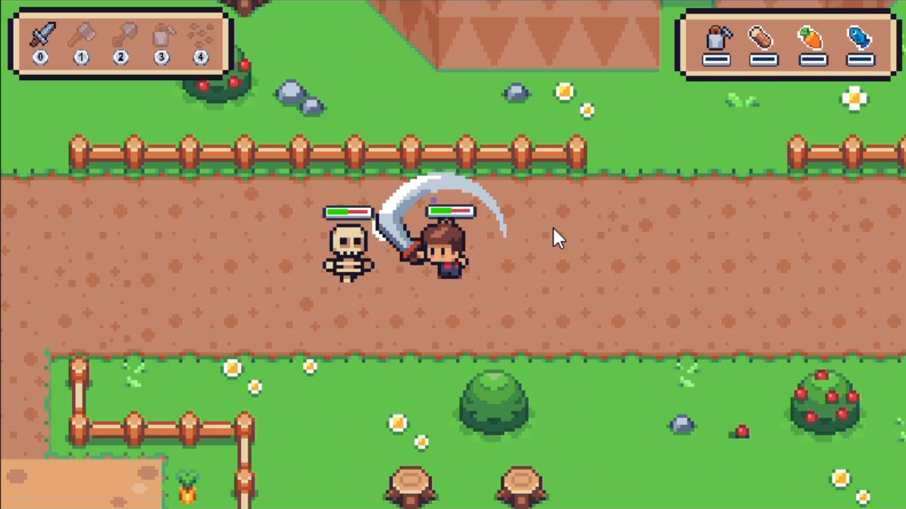

# Learning-2d-rpg

2D Top-Down RPG developed as part of the CSJ Academy 'Start Game Dev' certification. Features include player movement, NPC interaction, inventory systems, and AI-driven enemy behavior.

## Framework (Unity & C#)
- 📑 Project Overview: 
This project is a comprehensive Top-Down RPG framework developed during my CSJ Academy "Start Game Dev" Certification (August 2025). It focuses on modular architecture, AI pathfinding, and interactive game systems.
Coming from a Graphic Design background, I utilized this project to bridge the gap between high-fidelity UI/UX and complex C# backend logic, ensuring a polished player experience from both a visual and technical perspective.

[**Watch the Gameplay Video**](https://github.com/user-attachments/assets/8ee9cba3-f252-4a13-8b2c-94b8133cfced)

## 🛠️ Technical Features & Learning Milestones
- Based on the CSJ Academy curriculum, I implemented the following core systems:

## 🧠 AI & Navigation
- NavMesh Implementation: Utilized Unity's Navigation Mesh for intelligent enemy pathfinding, allowing NPCs and enemies to navigate around obstacles dynamically.
- Enemy State Machine: Built logic for different enemy behaviors (Patrol, Chase, Attack) using state-based transitions.

## 🎒 Core RPG Systems
- Character & NPC Systems: Implemented player movement, animation controllers, and an interactive NPC dialogue/implementation system.
- Crafting & Farming: Developed a modular system for resource gathering (Farming) and item creation (Crafting).
- Inventory & HUD: Designed a responsive Head-Up Display (HUD) to track player stats and inventory states in real-time.

## 🏗️ Architecture & Tools
- Scene Management: Efficiently handling transitions between different game maps and persistent data storage.
- Sound Management: A centralized Audio Manager for spatial sound effects and background music.

## 🖥️ Tech Stack
- Engine: Unity
- Language: C# (Object-Oriented Programming)
- UI Design: Corel Draw / Unity UI
- Logic Patterns: State Machines, NavMesh, Singleton Patterns

## 📜 Certification
- This project was the final requirement for the Start Game Dev "Pixel Top Down" Course by CSJ Academy.
- [**Game Dev Cert**](https://alunos.crieseusjogos.com.br/en/club/csj-digital/product/1553177/certificate/f2a061f6-bdac-4bbb-b6f6-da644dfb0fb3--768080572/validate)
- Modules Covered: Programming Intro, Scene Management, Game Character, NPC Implementation, Crafting & Farming, Enemy using AI (Nav Mesh), Sound Effects, HUD, and Publishing.

## 📧 Contact & Networking
- Currently based in Dublin, Ireland.
- [**LinkedIn:**](https://www.linkedin.com/in/eversonspinola/)
- Email: everson_spinola@hotmail.com
